# MCP Server Chart - Architecture

한국어 | [English](#english)

---

## 시스템 아키텍처 개요

MCP Server Chart의 전체 시스템 구성도입니다. 클라이언트부터 차트 출력까지의 전체 구조를 보여줍니다.

## 요청 처리 흐름 (Request Lifecycle)

클라이언트가 차트를 생성 요청할 때의 전체 흐름입니다.

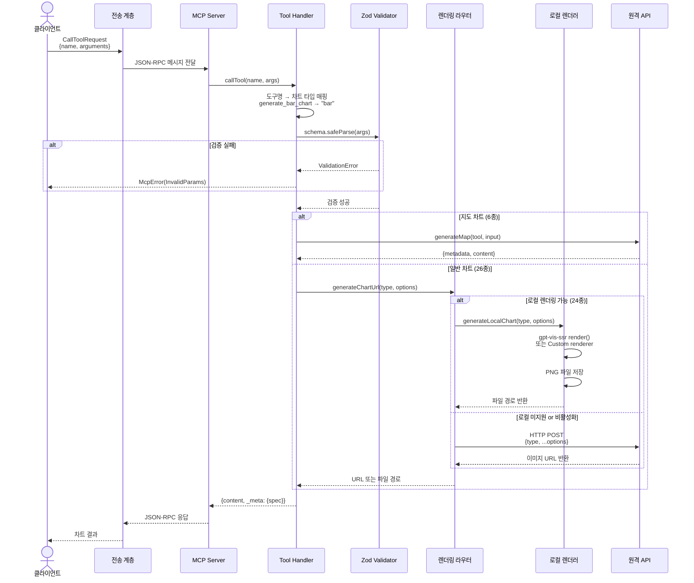

## 전송 프로토콜 비교

세 가지 전송 프로토콜의 연결 및 통신 흐름입니다.

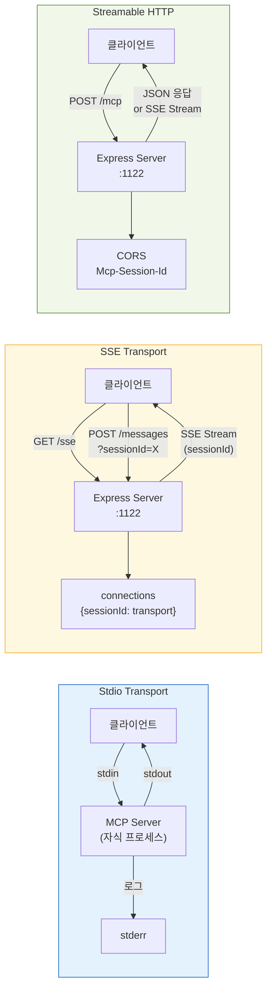

## 렌더링 엔진 의사결정 트리

차트 생성 요청 시 로컬/원격 렌더링을 결정하는 흐름입니다.

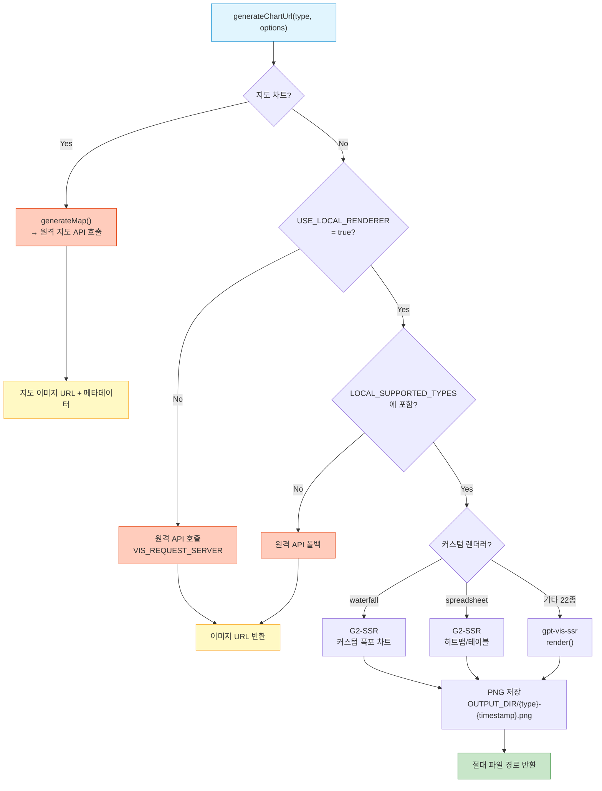

## 도구 등록 및 필터링

서버 시작 시 도구가 등록되고 필터링되는 과정입니다.

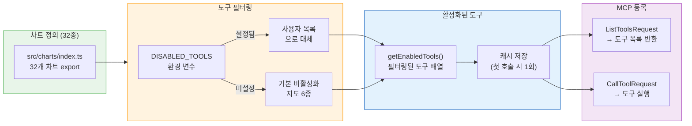

## 에이전트 통합 예제

`examples/chart-agent/`의 에이전트가 MCP 서버와 통신하는 흐름입니다.

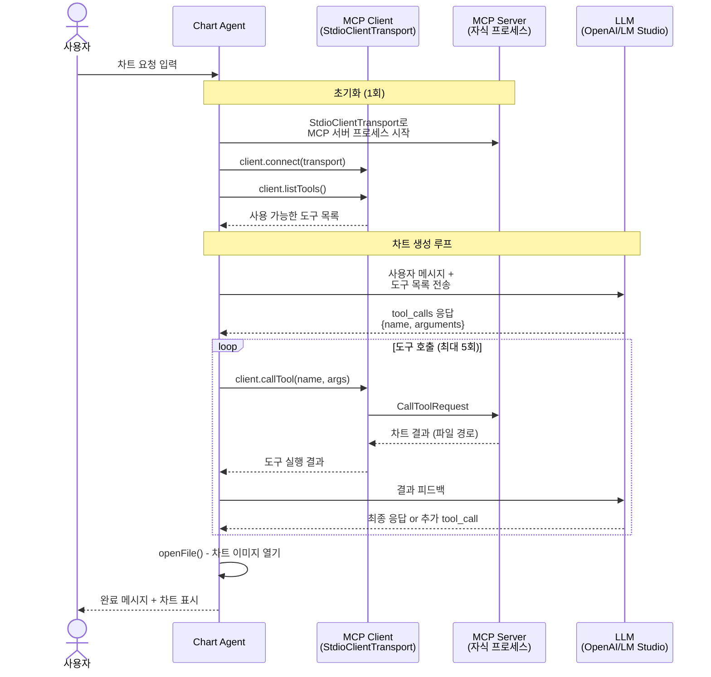

## 프로젝트 디렉토리 구조

```mermaid
graph TD
    Root["mcp-server-chart/"]

    Root --> Src["src/"]
    Root --> Examples["examples/"]
    Root --> Docker["docker/"]
    Root --> Docs["docs/"]

    Src --> Index["index.ts<br/><i>CLI 진입점</i>"]
    Src --> ServerTS["server.ts<br/><i>MCP 서버 생성</i>"]
    Src --> SDK["sdk.ts<br/><i>공개 API</i>"]

    Src --> Services["services/"]
    Services --> StdioS["stdio.ts"]
    Services --> SseS["sse.ts"]
    Services --> StreamS["streamable.ts"]

    Src --> Utils["utils/"]
    Utils --> CallToolU["callTool.ts<br/><i>도구 실행 파이프라인</i>"]
    Utils --> GenerateU["generate.ts<br/><i>차트 생성 (로컬/원격)</i>"]
    Utils --> LocalR["local-renderer.ts<br/><i>로컬 렌더링 엔진</i>"]
    Utils --> EnvU["env.ts<br/><i>환경 변수 관리</i>"]
    Utils --> ValidatorU["validator.ts<br/><i>커스텀 검증</i>"]
    Utils --> LoggerU["logger.ts<br/><i>통합 로깅</i>"]
    Utils --> SchemaU["schema.ts<br/><i>Zod → JSON Schema</i>"]

    Src --> ChartsDir["charts/"]
    ChartsDir --> BaseC["base.ts<br/><i>공통 스키마</i>"]
    ChartsDir --> ChartFiles["*.ts × 31<br/><i>개별 차트 정의</i>"]
    ChartsDir --> ChartIndex["index.ts<br/><i>전체 export</i>"]

    Examples --> AgentDir["chart-agent/"]
    AgentDir --> AgentTS["agent.ts"]

    style Root fill:#f5f5f5,stroke:#616161
    style Src fill:#e3f2fd,stroke:#1565c0
    style Services fill:#fff3e0,stroke:#ff9800
    style Utils fill:#fce4ec,stroke:#e91e63
    style ChartsDir fill:#e8f5e9,stroke:#4caf50
    style Examples fill:#f3e5f5,stroke:#9c27b0
```

## 환경 변수 구성도

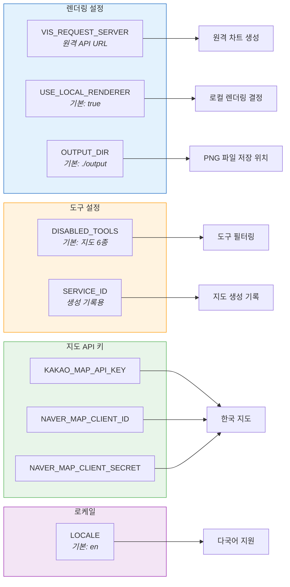

---

## English

# System Architecture Overview

Complete system architecture of MCP Server Chart, showing the full structure from client to chart output.

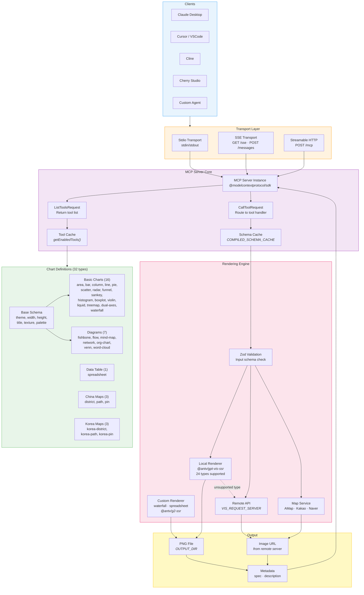

## Request Lifecycle

Complete flow when a client requests chart generation.

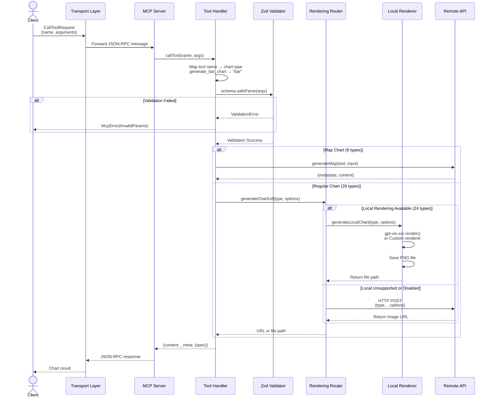

## Rendering Decision Tree

Decision flow for local vs. remote rendering when generating a chart.

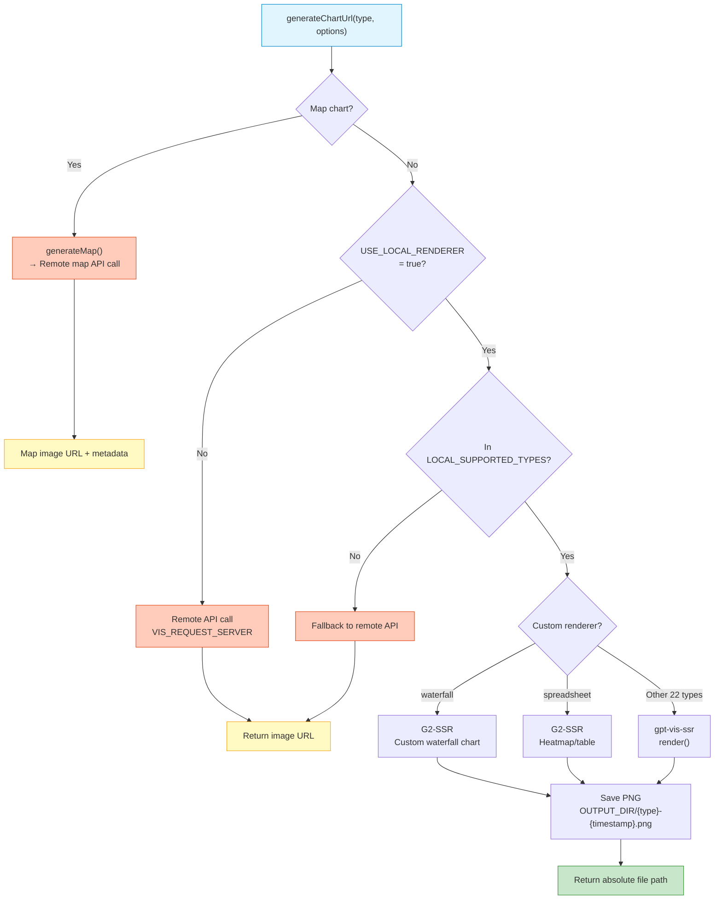

## Transport Protocol Comparison

Connection and communication flow for the three transport protocols.

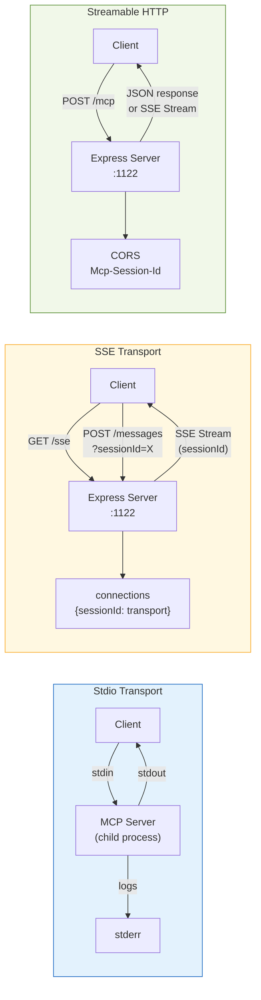

## Agent Integration Example

Communication flow between the example agent (`examples/chart-agent/`) and MCP server.

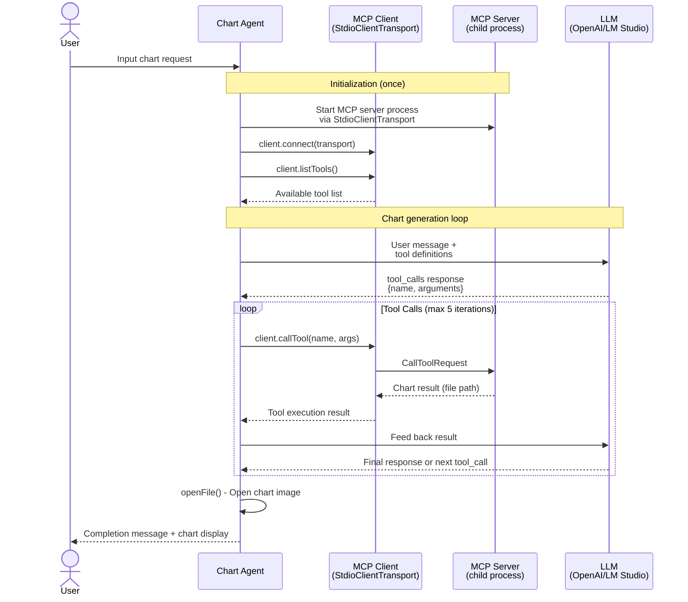
