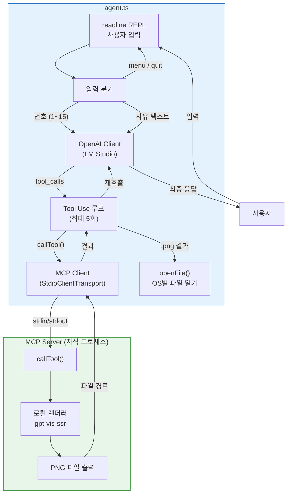
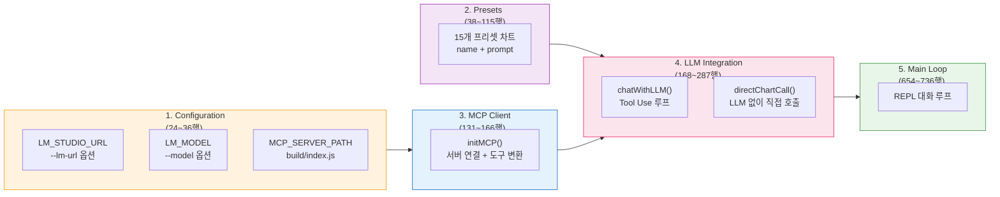
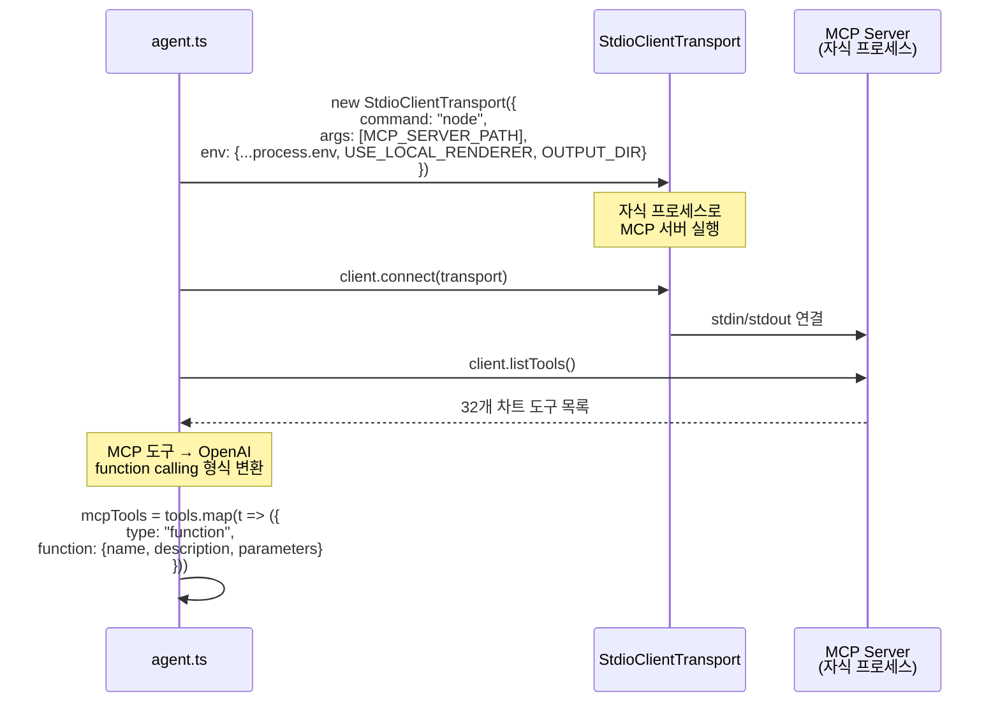
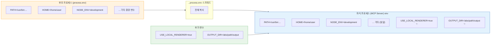
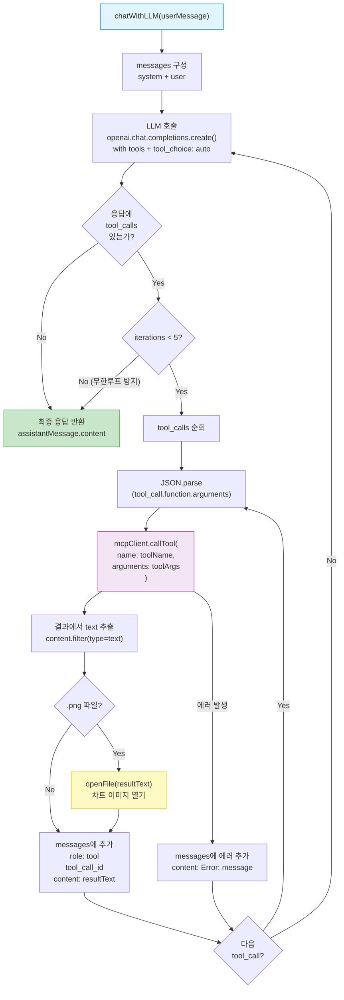
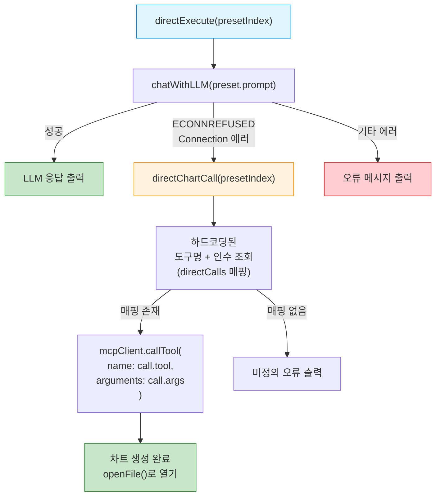
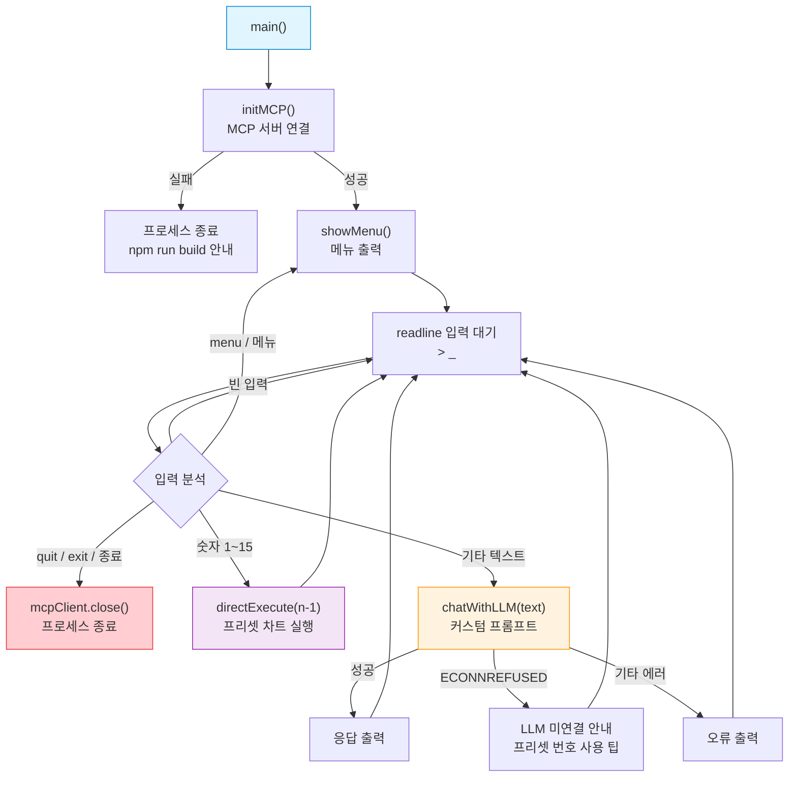

# MCP Chart Agent - Interactive CLI

LM Studio (Gemma3:4b) + MCP Server Chart를 사용한 인터랙티브 차트 생성 에이전트입니다.

## 아키텍처 개요

`agent.ts`는 **MCP 클라이언트 구현의 레퍼런스 예제**로, MCP 프로토콜로 도구를 발견하고, OpenAI 호환 LLM의 function calling과 결합하여 **자연어 → 차트 생성 파이프라인**을 완성합니다.



## 파일 구조 (5개 영역)



## 사전 요구사항

1. **LM Studio** 설치 및 Gemma3:4b 모델 로드
   - LM Studio에서 로컬 서버 시작 (기본: `http://localhost:1234/v1`)

2. **MCP Server Chart** 빌드 완료
   ```bash
   # 프로젝트 루트에서
   npm run build
   ```

## 설치 및 실행

```bash
cd examples/chart-agent
npm install
npx tsx agent.ts
```

## 사용법

### 프리셋 차트 (번호 선택)
숫자를 입력하면 바로 차트가 생성됩니다. LLM 없이도 동작합니다.

```
> 1    # 꺾은선 차트 - 월별 매출
> 5    # 컬럼 차트 - 분기별 매출
> 10   # 워터폴 차트 - 손익 분석
```

### 커스텀 프롬프트
자연어로 차트를 요청합니다. LM Studio가 실행 중이어야 합니다.

```
> 시장 점유율을 원형 차트로 보여줘: 삼성 25%, 애플 20%, 샤오미 15%, 기타 40%
> 2020년부터 2025년까지 연도별 매출 추이를 라인 차트로 그려줘. 데이터: 2020년 120억, 2021년 145억, 2022년 178억, 2023년 163억, 2024년 210억, 2025년 258억. X축은 '연도', Y축은 '매출(억원)'으로 표시해줘.
> 2025년 국내 클라우드 시장 점유율을 도넛 차트로 보여줘. AWS 35%, Azure 28%, GCP 20%, NCP 12%, 기타 5%.
> 부서별 인원수를 가로 막대 차트로 비교해줘. 개발팀 45명, 디자인팀 18명, 마케팅팀 22명, 영업팀 30명, 경영지원팀 12명.
> iPhone과 Galaxy의 5가지 항목(카메라, 배터리, 성능, 디자인, 가성비)을 레이더 차트로 비교해줘.
> 웹사이트 사용자 전환 퍼널을 생키 차트로 시각화해줘. 방문 → 회원가입 5000명, 방문 → 이탈 3000명, 회원가입 → 구매 2000명, 회원가입 → 장바구니만 1500명, 구매 → 재구매 800명.
```

### 옵션
```bash
# LM Studio URL 변경
npx tsx agent.ts --lm-url http://localhost:1234/v1

# 모델 변경
npx tsx agent.ts --model gemma-3-4b-it
```

## 명령어
- `menu` 또는 `메뉴` - 메뉴 다시 표시
- `quit` 또는 `종료` - 종료
- `1-15` - 프리셋 차트 생성
- (텍스트) - LLM에 커스텀 프롬프트 전달

---

## 상세 설명

### 1. Configuration (24~36행)

```typescript
const LM_STUDIO_URL = process.argv.includes("--lm-url")
  ? process.argv[process.argv.indexOf("--lm-url") + 1]
  : "http://localhost:1234/v1";

const LM_MODEL = process.argv.includes("--model")
  ? process.argv[process.argv.indexOf("--model") + 1]
  : "gemma-3-4b-it";

const MCP_SERVER_PATH = path.resolve(__dirname, "../../build/index.js");
```

| 변수 | 설명 | 기본값 |
|---|---|---|
| `LM_STUDIO_URL` | LLM 백엔드 주소 | `http://localhost:1234/v1` |
| `LM_MODEL` | 사용할 모델명 | `gemma-3-4b-it` |
| `MCP_SERVER_PATH` | 빌드된 MCP 서버 진입점 | `../../build/index.js` |

CLI 인수 `--lm-url`, `--model`로 오버라이드할 수 있습니다.

### 2. Presets (38~115행) — 15개 프리셋 차트

LLM 없이도 빠르게 테스트할 수 있는 프리셋 차트 정의입니다. 각 프리셋은 `{name, prompt}` 형태입니다.

| # | 차트 종류 | MCP 도구 |
|---|---|---|
| 1 | 꺾은선 차트 (월별 매출) | `generate_line_chart` |
| 2 | 막대 차트 (프로그래밍 언어) | `generate_bar_chart` |
| 3 | 원형 차트 (예산 배분) | `generate_pie_chart` |
| 4 | 영역 차트 (웹 트래픽) | `generate_area_chart` |
| 5 | 컬럼 차트 (분기별 매출) | `generate_column_chart` |
| 6 | 산점도 (키 vs 몸무게) | `generate_scatter_chart` |
| 7 | 레이더 차트 (역량 평가) | `generate_radar_chart` |
| 8 | 퍼널 차트 (영업 파이프라인) | `generate_funnel_chart` |
| 9 | 이중축 차트 (매출 vs 이익률) | `generate_dual_axes_chart` |
| 10 | 워터폴 차트 (손익 분석) | `generate_waterfall_chart` |
| 11 | 생키 차트 (에너지 흐름) | `generate_sankey_chart` |
| 12 | 워드 클라우드 (기술 키워드) | `generate_word_cloud_chart` |
| 13 | 마인드맵 (프로젝트 구조) | `generate_mind_map` |
| 14 | 조직도 (회사 구조) | `generate_organization_chart` |
| 15 | 스프레드시트 (학생 성적) | `generate_spreadsheet` |

### 3. MCP 클라이언트 초기화 — `initMCP()` (135~166행)



#### `...process.env` 란?

```typescript
env: {
  ...process.env,                                    // 부모 프로세스의 환경 변수 전체 복사
  USE_LOCAL_RENDERER: "true",                        // + 추가/덮어쓰기
  OUTPUT_DIR: path.resolve(__dirname, "./output"),   // + 추가/덮어쓰기
},
```

`...process.env`는 **현재 프로세스의 모든 환경 변수를 복사하여 자식 프로세스에 전달**하는 JavaScript 스프레드 문법입니다.

MCP 서버는 **자식 프로세스**(`node build/index.js`)로 실행되는데, `env` 옵션을 지정하면 자식 프로세스의 환경 변수가 해당 객체로 **완전히 대체**됩니다.

- `...process.env` **없이**: `PATH`, `HOME` 등 시스템 환경 변수가 모두 사라져 자식 프로세스가 정상 동작하지 못함
- `...process.env` **있으면**: 기존 환경 변수를 모두 상속하면서, `USE_LOCAL_RENDERER`와 `OUTPUT_DIR`만 추가/덮어쓰기



### 4. LLM 통합 — `chatWithLLM()` (205~287행)

에이전트의 **핵심 로직**입니다. LLM과 MCP 도구를 연결하는 **Tool Use 루프**를 구현합니다.



#### 시스템 프롬프트 (174~203행)

`SYSTEM_PROMPT`에는 **모든 차트 타입별 데이터 형식 예시**가 포함되어 있어, LLM이 올바른 스키마로 도구를 호출할 수 있도록 가이드합니다:

```
- 꺾은선/영역: data: [{time: "라벨", value: 숫자}]
- 막대/컬럼:   data: [{category: "라벨", value: 숫자}]
- 산점도:      data: [{x: 숫자, y: 숫자}]
- 생키:        data: [{source: "출발", target: "도착", value: 숫자}]
- 마인드맵:    data: {name: "루트", children: [{name: "자식"}]}
  ...
```

### 5. 폴백 메커니즘 — `directExecute()` + `directChartCall()` (347~651행)

LLM에 연결할 수 없을 때의 **그레이스풀 디그레이드** 전략입니다.



`directChartCall()`은 15개 프리셋 각각에 대해 **도구명과 정확한 인수를 하드코딩**(375~617행)하고 있어, LLM 없이도 MCP 도구를 직접 호출하여 차트를 생성합니다.

### 6. 메인 REPL 루프 — `main()` (654~736행)



### 7. 유틸리티 함수

#### `openFile()` (290~303행) — OS별 파일 열기

| OS | 명령어 |
|---|---|
| Windows | `start "" "파일경로"` |
| macOS | `open "파일경로"` |
| Linux | `xdg-open "파일경로"` |

#### `showMenu()` (306~344행)

ANSI 색상 코드를 사용한 터미널 UI 메뉴를 출력합니다. 프리셋 목록, LLM 정보, 사용법 안내를 표시합니다.
